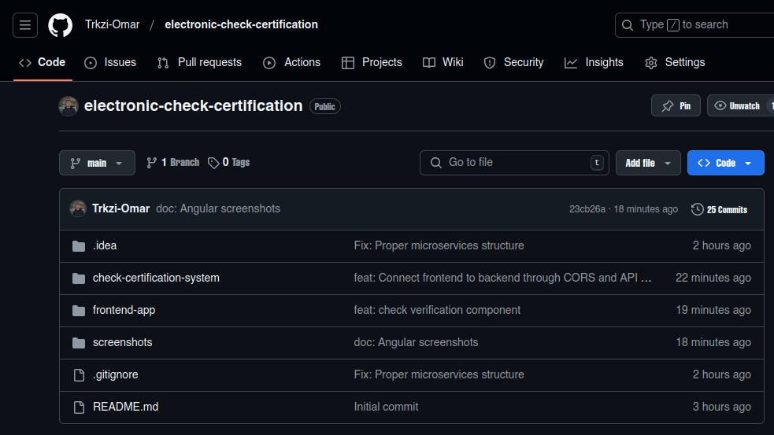

# RapportExamen Systèmes Distribués

## Fait par : Omar Trkzi



## A. Partie Conception

### 1. Architecture technique du projet
L'architecture de ce projet repose sur une série de micro-services interconnectés, chacun ayant un rôle spécifique dans le processus de certification électronique de chèques. Les micro-services principaux incluent :

- **Commerçant-Service** : Gère les informations des chèques.
- **Banque-Centrale-Service** : Gère les informations des agences bancaires.
- **Agence-Bancaire-Service** : Gère les comptes bancaires et les opérations associées.
- **Authentication-Service** : Assure la sécurité via OAuth2 et OIDC avec Keycloak.
- **Kafka Broker** : Facilite la messagerie asynchrone et l'audit.
- **Data Analytics Service** : Fournit des analyses en temps réel à partir des messages Kafka.

Les communications entre ces services se font de manière synchrone via Open Feign et de manière asynchrone via Kafka.

**Diagramme d'architecture :**


### 2. Diagramme de classes
Le modèle conceptuel de l'application inclut des entités telles que Check, BankAgency, et Account, chacune avec ses attributs et relations. Ces entités sont essentielles pour représenter les données métier de l'application.

**Diagramme de classes :**  


### 3. Diagramme de séquence
Ce diagramme illustre l'enchaînement des appels et des communications entre les micro-services lors d'une opération de certification de chèque, depuis la capture des données par le commerçant jusqu'à la confirmation de la certification.

**Diagramme de séquence :**  


---

## B. Partie Implémentation

### 4. Créer un Projet Maven incluant les micro-services
La structure du projet est organisée en modules Maven, chacun représentant un micro-service distinct. Voici la structure actuelle du projet :


Structure détaillée :
```
check-certification-system
├── commercant-service
├── banque-centrale-service
├── agence-bancaire-service
├── gateway-service
├── discovery-service
├── config-service
├── data-analytics-service
└── front-web-app
```

### 5. Développer et tester les micro-services Discovery-service, Gateway-service et Config-service

#### Discovery Service (Eureka)


```java
@SpringBootApplication
@EnableEurekaServer
public class DiscoveryServiceApplication {
    public static void main(String[] args) {
        SpringApplication.run(DiscoveryServiceApplication.class, args);
    }
}
```

#### Gateway Service Configuration


```yaml
spring:
  cloud:
    gateway:
      routes:
        - id: commercant-service
          uri: lb://COMMERCANT-SERVICE
          predicates:
            - Path=/api/commercant/**
```

#### Config Service


```properties
spring.application.name=config-service
server.port=8888
spring.cloud.config.server.git.uri=https://github.com/youssfi/check-certification-config-repo.git
```

### 6. Développer et tester les 3 micro-services fonctionnels

#### Commercant-Service


```java
@RestController
@RequestMapping("/api/commercant/checks")
public class CheckController {
    @PostMapping
    public ResponseEntity<CheckResponseDTO> createCheck(@RequestBody CheckRequestDTO checkDTO) {
        return ResponseEntity.ok(checkService.saveCheck(checkDTO));
    }
}
```

#### BanqueCentrale-Service


```java
@Entity
public class BankAgency {
    @Id @GeneratedValue(strategy = GenerationType.IDENTITY)
    private Long id;
    private String name;
    private String city;
    private String serviceURL;
}
```

#### Agence-Bancaire-Service


```java
@Entity
public class Account {
    @Id
    private String number;
    private Double balance;
    private String clientReference;
    @Enumerated(EnumType.STRING)
    private AccountType type;
}
```

### 7. Développer un simple frontend web pour l'application


Structure du frontend Angular :
```
frontend-app/
├── src/
│   ├── app/
│   │   ├── components/
│   │   │   ├── check-list/
│   │   │   ├── check-form/
│   │   │   └── check-details/
│   │   └── services/
│   └── assets/
└── package.json
```

### 8. Sécuriser l'application avec une authentification Keycloak


```yaml
keycloak:
  realm: check-certification-realm
  auth-server-url: http://localhost:8080/auth
  resource: check-certification-client
  public-client: true
  bearer-only: true
```

### 9. Développer le service de data Analytics basé sur KAFKA


```java
@Service
public class CheckAnalyticsService {
    @KafkaListener(topics = "check-certifications")
    public void processCheckCertification(CheckEvent event) {
        // Traitement des événements de certification
    }
}
```

### 10. Déployer l'application avec Docker et Docker compose


```yaml
version: '3'
services:
  discovery-service:
    build: ./discovery-service
    ports:
      - "8761:8761"
  gateway-service:
    build: ./gateway-service
    ports:
      - "8080:8080"
    depends_on:
      - discovery-service
  keycloak:
    image: jboss/keycloak
    ports:
      - "8180:8080"
  kafka:
    image: confluentinc/cp-kafka
    ports:
      - "9092:9092"
```
